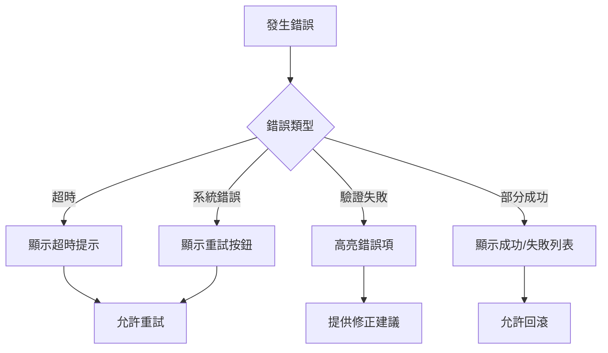

# 前端 AI 建議功能整合規範

## 文件資訊
- 版本：v1.0
- 創建日期：2024-09-03
- 最後更新：2024-09-03
- 狀態：已確認
- 參與團隊：前端團隊、後端團隊、AI Agent團隊

## 1. 執行摘要

本文件記錄了前端團隊與後端團隊針對 AI 設計建議功能的討論結果與技術決策。確立了完整的責任劃分、資料格式、通訊協議與實作時程。

### 1.1 核心共識

- **位置計算**：完全由後端負責，前端只接收計算好的座標
- **視覺呈現**：完全由前端負責，包含預覽、動畫、交互
- **即時通訊**：採用 SSE (Server-Sent Events) 推送進度
- **批次處理**：支援部分接受/拒絕，後端處理依賴關係

## 2. 責任劃分

### 2.1 前端團隊職責

#### 專注事項 ✅
- 預覽狀態的視覺呈現（高亮、半透明、動畫效果）
- 接受/拒絕建議的 UI 交互
- 建議詳情展示與分組
- 批次操作進度顯示
- SSE 事件處理與進度更新

#### 不處理事項 ❌
- 節點位置計算邏輯
- 建議正確性驗證
- 依賴關係排序
- 代碼生成與分配
- 資料庫驗證

### 2.2 後端團隊職責

#### 專注事項 ✅
- 節點位置計算（避免重疊、保持整齊）
- 資料格式轉換（Agent格式 → 前端格式）
- 建議驗證與修正循環
- 代碼預分配（MOD-xxx, UC-xxx等）
- 依賴關係處理與排序
- 批次交易與回滾機制

#### 提供給前端 ✅
- 計算好的 x, y 座標
- 完整的 TypeScript 類型定義
- Mock API 供開發測試
- SSE 進度推送
- 錯誤處理策略

## 3. 資料格式定義

### 3.1 Viewport 資訊格式

```typescript
interface ViewportInfo {
  x: number;        // 視窗左上角 x 座標
  y: number;        // 視窗左上角 y 座標  
  zoom: number;     // 縮放比例 (0.1 ~ 2.0)
  width: number;    // 視窗寬度
  height: number;   // 視窗高度
}

interface CanvasState {
  viewport: ViewportInfo;
  nodes?: Array<{
    id: string;
    position: { x: number; y: number };
    dimensions: { width: number; height: number };
    type: string;
  }>;
}
```

### 3.2 核心建議格式

```typescript
interface FrontendSuggestion {
  // 識別資訊
  id: string;                          // 格式：sug_<timestamp>_<random>
  tempNodeId?: string;                 // 格式：temp_<TYPE>_<timestamp>_<index>
  groupId?: string;                    // 批次群組ID
  
  // 動作資訊
  action: 'create' | 'update' | 'delete' | 'connect';
  targetNodeId?: string;               // update/delete 時的目標節點
  
  // 視覺化資訊（後端計算提供）
  visual: {
    position: {
      x: number;
      y: number;
      calculated: boolean;
    };
    style?: {
      borderColor?: string;
      backgroundColor?: string;
      opacity?: number;              // 預設 0.6
      animation?: 'pulse' | 'glow' | 'bounce';
    };
    preview: {
      show: boolean;
      dimOthers: boolean;
    };
  };
  
  // 資料內容
  data: {
    type: 'MODULE' | 'USE_CASE' | 'SEQUENCE' | 'API' | 'DTO';
    code?: string;                    // 預分配的代碼
    title: string;
    description?: string;
    details: any;                     // 根據類型不同的詳細資料
  };
  
  // 關聯資訊
  relations: {
    parentId?: string;
    dependencies: string[];           // 必須先應用的建議
    conflicts?: string[];            // 衝突的建議
  };
  
  // 元資料
  metadata: {
    reason: string;                   // 建議理由（中文）
    confidence: number;               // 信心度 (0-1)
    priority: 'critical' | 'high' | 'medium' | 'low';
    canReject: boolean;
  };
}
```

### 3.3 命名規則

#### tempNodeId 格式
```typescript
// 格式確認
tempNodeId: `temp_${TYPE}_${timestamp}_${index}`

// 範例
"temp_MODULE_1699001234567_001"
"temp_USE_CASE_1699001234567_002"
"temp_SEQUENCE_1699001234567_003"
"temp_API_1699001234567_004"
"temp_DTO_1699001234567_005"
```

#### batchId 格式
```typescript
// 格式
batchId: `batch_${timestamp}_${hash}`

// 範例
"batch_1699001234567_a1b2c3"

// 用途
1. 追蹤整批建議
2. 批次回滾
3. 查詢批次狀態
```

## 4. 技術決策

### 4.1 即時通訊方案

**決定：採用 SSE (Server-Sent Events)**

#### 選擇理由
- ✅ 實作簡單，符合單向推送需求
- ✅ 自動重連機制
- ✅ 瀏覽器原生支援
- ✅ 相比 WebSocket 更輕量

#### 前端實作範例
```typescript
const eventSource = new EventSource('/api/v1/ai/generate-design/stream');

eventSource.onmessage = (event) => {
  const data: AIGenerationProgress = JSON.parse(event.data);
  updateProgress(data.stage, data.progress, data.message);
};

eventSource.onerror = (error) => {
  console.error('SSE 連線錯誤:', error);
  eventSource.close();
};
```

#### SSE 事件格式
```typescript
interface AIGenerationProgress {
  stage: 'understanding' | 'planning' | 'generating' | 'validating' | 'complete';
  progress: number;        // 0-100
  message: string;         // 中文訊息
  batchId?: string;       // 完成時返回
}
```

### 4.2 批次操作策略

**支援部分接受/拒絕**

```typescript
// 錯誤處理策略
enum ErrorStrategy {
  CONTINUE = 'continue',      // 繼續執行，記錄失敗項
  STOP = 'stop',              // 遇錯即停，全部回滾  
  INTERACTIVE = 'interactive' // 詢問用戶（未來功能）
}

// 處理流程
1. 用戶選擇接受部分建議（如 5/10 個）
2. 前端發送選中的 suggestionIds
3. 後端自動處理依賴關係
4. 返回應用結果與映射表
5. 支援整批回滾
```

### 4.3 視覺規範

```typescript
const VISUAL_SPECS = {
  preview: {
    opacity: 0.6,                    // 建議節點透明度
    highlightColor: '#1890ff',       // 使用 Ant Design 主題色
    animationDuration: 300,          // 動畫持續時間 (ms)
    dimmedOpacity: 0.3               // 其他節點淡化程度
  },
  
  animations: {
    pulse: 'pulse 2s infinite',      // 脈動效果
    glow: 'glow 1.5s infinite',      // 發光效果
    bounce: 'bounce 1s'               // 彈跳效果（新節點）
  },
  
  colors: {
    accepted: '#52c41a',              // 接受 - 綠色
    rejected: '#ff4d4f',              // 拒絕 - 紅色
    pending: '#1890ff',               // 待定 - 藍色
    conflict: '#faad14'               // 衝突 - 橙色
  }
};
```

### 4.4 效能優化策略

```typescript
const PERFORMANCE_LIMITS = {
  maxSuggestionsPerView: 20,         // 每次顯示上限
  enableVirtualScroll: true,         // >50 時啟用虛擬滾動
  groupingThreshold: 10,              // >10 時自動分組
  batchSize: 5,                      // 批次渲染大小
  cacheTimeout: 5 * 60 * 1000        // 建議快取 5 分鐘
};
```

## 5. API 端點規範

### 5.1 核心端點

| 端點 | 方法 | 用途 | 狀態 |
|-----|------|------|------|
| `/api/v1/ai/generate-design` | POST | 生成設計建議 | 必要 |
| `/api/v1/ai/generate-design/stream` | GET | SSE 進度推送 | 必要 |
| `/api/v1/ai/generate-design/mock` | GET | Mock 資料 | 開發用 |
| `/api/v1/ai/validate-suggestions` | POST | 驗證建議 | 必要 |
| `/api/v1/ai/apply-suggestions` | POST | 批次應用 | 必要 |
| `/api/v1/ai/rollback/:batchId` | POST | 批次回滾 | 選用 |
| `/api/v1/ai/history` | GET | 歷史記錄 | 選用 |

### 5.2 請求/回應範例

#### 生成設計建議
```typescript
// Request
POST /api/v1/ai/generate-design
{
  projectId: string;
  message: string;
  context?: {
    viewport?: ViewportInfo;
    focusNodeId?: string;
  };
  options?: {
    maxSuggestions?: number;
    targetComplexity?: 'simple' | 'moderate' | 'complex';
  };
}

// Response
{
  success: true,
  data: {
    batchId: string;
    suggestions: FrontendSuggestion[];
    summary: string;
    stats: {
      total: number;
      byType: Record<NodeType, number>;
      byPriority: Record<Priority, number>;
      estimatedTime: number;
    };
    metadata: {
      processingTime: number;
      confidence: number;
      modelUsed: string;
    };
  }
}
```

#### 批次應用建議
```typescript
// Request
POST /api/v1/ai/apply-suggestions
{
  projectId: string;
  suggestionIds: string[];
  rejectedIds?: string[];
  options?: {
    dryRun?: boolean;
    stopOnError?: boolean;
  };
}

// Response
{
  success: true,
  data: {
    applied: Array<{
      suggestionId: string;
      tempNodeId?: string;
      actualResourceId: string;
      success: boolean;
      error?: string;
    }>;
    failed: Array<{
      suggestionId: string;
      reason: string;
      canRetry: boolean;
    }>;
    rollbackAvailable: boolean;
    mappings: Array<{
      tempNodeId: string;
      actualId: string;
      type: NodeType;
    }>;
  }
}
```

## 6. 實作時程

### 6.1 前端實作計畫

| 階段 | 時程 | 工作項目 | 依賴 |
|-----|------|---------|-----|
| 第一階段 | Day 1-3 | - 整合 TypeScript 定義<br>- 實作預覽模式 UI<br>- 接入 SSE 進度推送 | Mock API |
| 第二階段 | Day 4-5 | - 批次操作介面<br>- 錯誤處理與回滾<br>- 建議分組顯示 | 真實 API |

### 6.2 後端交付時程

| 階段 | 時程 | 交付項目 | 狀態 |
|-----|------|---------|------|
| 立即可用 | Day 0 | - Mock API<br>- TypeScript 定義 | ✅ 已完成 |
| 第一批 | Day 1-2 | - generate-design 端點<br>- SSE 進度端點 | 🚧 開發中 |
| 第二批 | Day 3-4 | - apply-suggestions 端點<br>- validate-suggestions 端點 | 📅 計劃中 |
| 第三批 | Day 5 | - rollback 端點<br>- history 端點 | 📅 計劃中 |

## 7. 效能與限制

### 7.1 響應時間承諾

| 請求類型 | 目標時間 | 最大時間 |
|---------|---------|---------|
| 簡單請求 | < 3 秒 | 5 秒 |
| 中等複雜 | < 7 秒 | 10 秒 |
| 複雜請求 | < 15 秒 | 30 秒 |

### 7.2 系統限制

- 單次最大建議數：20 個
- 建議快取時間：5 分鐘
- SSE 心跳間隔：15 秒
- 批次應用上限：50 個建議
- 超時自動斷開：30 秒

## 8. 錯誤處理

### 8.1 錯誤碼定義

```typescript
enum AIErrorCode {
  // AI 相關
  AI_TIMEOUT = 'AI_TIMEOUT',                    // AI 處理超時
  AI_INVALID_INPUT = 'AI_INVALID_INPUT',        // 輸入無效
  AI_QUOTA_EXCEEDED = 'AI_QUOTA_EXCEEDED',      // 配額超限
  AI_SERVICE_ERROR = 'AI_SERVICE_ERROR',        // 服務錯誤
  
  // 驗證相關
  VALIDATION_FAILED = 'VALIDATION_FAILED',       // 驗證失敗
  DEPENDENCY_ERROR = 'DEPENDENCY_ERROR',         // 依賴錯誤
  CONFLICT_DETECTED = 'CONFLICT_DETECTED',       // 衝突檢測
  
  // 應用相關
  APPLY_FAILED = 'APPLY_FAILED',                // 應用失敗
  ROLLBACK_FAILED = 'ROLLBACK_FAILED',          // 回滾失敗
  PARTIAL_SUCCESS = 'PARTIAL_SUCCESS'           // 部分成功
}
```

### 8.2 錯誤處理流程



## 9. 測試策略

### 9.1 測試環境配置

```typescript
// 開發環境
const DEV_CONFIG = {
  apiBaseUrl: 'http://localhost:4400',
  mockMode: true,
  sseTimeout: 5000,
  testAccount: {
    email: 'test@example.com',
    password: 'Test123456',
    projectId: 'test-project-001'
  }
};
```

### 9.2 測試場景

1. **基本流程測試**
   - 生成建議 → 預覽 → 接受/拒絕 → 應用

2. **錯誤處理測試**
   - 網路中斷
   - 超時處理
   - 部分失敗

3. **效能測試**
   - 大量建議（>50個）
   - 並發請求
   - 快取有效性

4. **相容性測試**
   - 不同瀏覽器的 SSE 支援
   - 移動端適配

## 10. 未來優化方向

### 10.1 短期優化（1-2週）
- 建議快取機制
- 預載策略（用戶輸入時預熱）
- 漸進式渲染

### 10.2 中期優化（1個月）
- WebSocket 雙向通訊
- 協作編輯支援
- 智能分組算法

### 10.3 長期優化（3個月）
- 離線模式支援
- 本地 AI 模型
- 學習用戶偏好

## 11. 關鍵決策記錄

| 決策項目 | 選擇方案 | 理由 | 決策日期 |
|---------|---------|------|---------|
| 即時通訊 | SSE | 簡單、單向推送足夠 | 2024-09-03 |
| 位置計算 | 後端負責 | 確保一致性、避免前端複雜度 | 2024-09-03 |
| ID 格式 | temp_TYPE_timestamp_index | 避免衝突、易於追蹤 | 2024-09-03 |
| 批次處理 | 支援部分接受 | 靈活性、用戶體驗 | 2024-09-03 |
| 錯誤策略 | 繼續執行+記錄 | 最大化成功項目 | 2024-09-03 |

## 12. 團隊共識

### 12.1 前端團隊確認
- ✅ 接受所有技術決策
- ✅ 理解責任劃分
- ✅ 同意實作時程

### 12.2 後端團隊承諾
- ✅ 按時交付 API
- ✅ 提供完整文件
- ✅ 支援測試需求

### 12.3 溝通機制
- 每日站會同步進度
- Slack 即時溝通
- 週會檢討與調整

## 附錄

### A. 相關文件
- [TypeScript 類型定義](./frontend-types.ts)
- [後端與Agent整合設計規範](./後端與Agent整合設計規範.md)
- [API 文件](./API端點清單.md)

### B. 聯絡人
- 前端團隊負責人：[待填]
- 後端團隊負責人：[待填]
- 產品經理：[待填]

### C. 版本歷史
| 版本 | 日期 | 作者 | 變更說明 |
|------|------|------|----------|
| v1.0 | 2024-09-03 | System | 初始版本，整合前端討論結果 |

---

**文件狀態**：✅ 已確認並開始實作