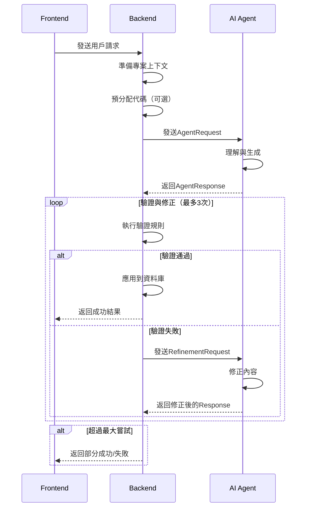
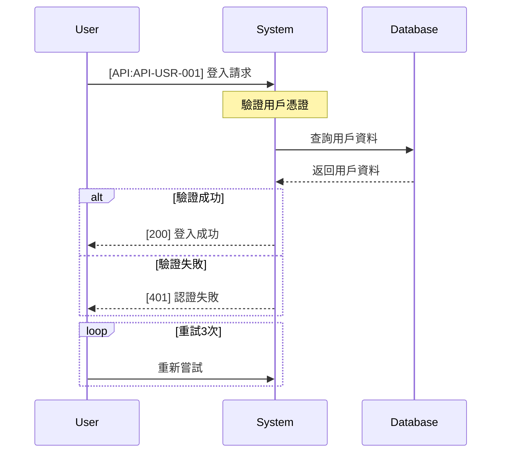

# 後端與AI Agent整合設計規範

## 版本資訊
- 文件版本：v1.1
- 創建日期：2024-09-03
- 最後更新：2024-09-03
- 狀態：設計階段
- 重要更新：新增前端設計建議支援（位置計算、預覽機制、批次處理）

## 1. 概述

本文件定義SpecForge後端(Node.js/TypeScript)與AI Agent服務(Python)之間的整合架構、通訊協議、資料格式與錯誤處理機制。

### 1.1 架構定位

```
┌─────────────┐     ┌─────────────┐     ┌─────────────┐     ┌─────────────┐
│    前端     │────▶│    後端     │────▶│  AI Agent   │────▶│   AI模型    │
│  (React)    │◀────│  (Node.js)  │◀────│  (Python)   │◀────│ (GPT/Claude)│
└─────────────┘     └─────────────┘     └─────────────┘     └─────────────┘
     :4000              :4400              :8000              External
```

### 1.2 責任劃分

| 組件 | 主要職責 | 技術棧 |
|------|---------|--------|
| **前端** | - 畫布狀態管理<br>- 預覽顯示<br>- 用戶交互<br>- 建議接受/拒絕<br>- 視覺化渲染 | React, TypeScript, ReactFlow, Ant Design |
| **後端** | - 業務邏輯驗證<br>- 資料持久化<br>- 權限控制<br>- 上下文準備<br>- 代碼分配<br>- 一致性檢查<br>- **位置計算**<br>- **格式轉換** | Node.js, TypeScript, Prisma, PostgreSQL |
| **AI Agent** | - 自然語言理解<br>- 設計建議生成<br>- 內容創作<br>- 模式識別<br>- **語義層級提示** | Python, FastAPI, LangChain, OpenAI |

## 2. 通訊協議

### 2.1 基本原則

1. **單向依賴**：只有後端可以呼叫Agent，Agent不能主動呼叫後端
2. **同步通訊**：使用HTTP REST API進行同步請求/回應
3. **內網隔離**：Agent服務不對外暴露，只在內網訪問
4. **狀態無關**：每個請求都包含完整上下文，Agent不保存狀態

### 2.2 API端點規範

#### 後端暴露給前端的端點
```
POST /api/v1/ai/chat              # AI對話
POST /api/v1/ai/generate-design   # 生成設計建議
POST /api/v1/ai/apply-suggestions # 應用建議
GET  /api/v1/ai/history           # 查詢歷史
```

#### Agent暴露給後端的端點
```
POST /api/v1/ai/plan              # 規劃設計
POST /api/v1/ai/refine            # 修正內容
POST /api/v1/ai/validate          # 驗證建議
GET  /api/v1/health               # 健康檢查
```

## 3. 資料格式定義

### 3.1 後端→Agent 請求格式

```typescript
interface AgentRequest {
  // 請求識別
  requestId: string;
  timestamp: string;
  
  // 用戶輸入
  userInput: {
    message: string;          // 用戶的自然語言輸入
    intent?: string;          // 可選：明確的意圖
    scope?: string;           // 可選：作用範圍
  };
  
  // 專案上下文（完整的現有結構）
  projectContext: {
    projectId: string;
    projectName: string;
    projectDescription?: string;
    
    // 現有資源（真實資料）
    modules: Array<{
      id: string;
      modCode: string;
      title: string;
      description?: string;
      parentId?: string;
      childrenCount: number;
    }>;
    
    useCases: Array<{
      id: string;
      ucCode: string;
      title: string;
      summary?: string;
      moduleId: string;
      moduleCode: string;
    }>;
    
    sequences: Array<{
      id: string;
      sdCode: string;
      title: string;
      useCaseId: string;
      mermaidSrc: string;
      apiCount: number;
    }>;
    
    apis: Array<{
      id: string;
      apiCode: string;
      method: string;
      endpoint: string;
      title: string;
      domain: string;
      linkedSequences: string[];
    }>;
    
    dtos: Array<{
      id: string;
      dtoCode: string;
      title: string;
      kind: 'request' | 'response';
      linkedApis: string[];
    }>;
  };
  
  // 代碼預分配（可選，用於確保唯一性）
  allocatedCodes?: {
    moduleCode?: string;
    ucCodes?: string[];
    sdCodes?: string[];
    apiCodes?: string[];
    dtoCodes?: string[];
  };
  
  // 處理選項
  options: {
    maxSuggestions: number;      // 最大建議數
    includeRationale: boolean;   // 是否包含理由說明
    strictValidation: boolean;   // 是否嚴格驗證
    targetComplexity: 'simple' | 'moderate' | 'complex';
  };
}
```

### 3.2 Agent→後端 回應格式

```typescript
interface AgentResponse {
  // 回應識別
  requestId: string;
  responseId: string;
  timestamp: string;
  processingTime: number;  // 毫秒
  
  // 理解結果
  understanding: {
    intent: string;              // 理解的意圖
    confidence: number;          // 信心度 0-1
    domain: string;              // 業務領域
    complexity: string;          // 複雜度評估
    summary: string;             // 理解摘要
  };
  
  // 設計建議
  suggestions: Array<{
    id: string;                  // 建議ID
    type: 'create' | 'update' | 'delete' | 'connect';
    priority: 'high' | 'medium' | 'low';
    confidence: number;
    
    // 建議的具體內容
    content: {
      resourceType: 'module' | 'useCase' | 'sequence' | 'api' | 'dto';
      
      // 新建資源時
      createData?: {
        title: string;
        description?: string;
        // 根據resourceType不同而不同的欄位
        details: any;
      };
      
      // 更新資源時
      updateData?: {
        targetId: string;        // 要更新的資源ID
        changes: any;             // 變更內容
      };
      
      // 刪除資源時
      deleteData?: {
        targetId: string;         // 要刪除的資源ID
        cascadeDelete: string[];  // 級聯刪除的資源
      };
      
      // 建立關聯時
      connectData?: {
        sourceId: string;
        targetId: string;
        relationType: string;
        metadata?: any;
      };
    };
    
    // 依賴關係
    dependencies: {
      requires: string[];         // 前置依賴的建議ID
      blocks: string[];           // 會被阻塞的建議ID
    };
    
    // 理由說明
    rationale?: {
      reason: string;             // 建議理由
      benefits: string[];         // 預期效益
      risks: string[];            // 潛在風險
    };
  }>;
  
  // 生成的具體內容（用於create類型的建議）
  generatedContent: {
    modules?: Array<{
      tempId: string;             // 臨時ID，對應到建議
      title: string;
      description?: string;
      suggestedCode?: string;     // 建議的代碼
    }>;
    
    useCases?: Array<{
      tempId: string;
      moduleId: string;           // 關聯的模組（可能是tempId）
      title: string;
      summary: string;
      actors: string[];
      suggestedCode?: string;
    }>;
    
    sequences?: Array<{
      tempId: string;
      useCaseId: string;
      title: string;
      mermaidSrc: string;
      suggestedCode?: string;
      parseResult?: {             // Mermaid解析結果
        actors: string[];
        apiRefs: string[];
        dtoRefs: string[];
      };
    }>;
    
    apis?: Array<{
      tempId: string;
      method: string;
      endpoint: string;
      title: string;
      description?: string;
      domain: string;
      suggestedCode?: string;
      requestSpec?: any;
      responseSpec?: any;
    }>;
    
    dtos?: Array<{
      tempId: string;
      title: string;
      kind: 'request' | 'response';
      schemaJson: any;
      suggestedCode?: string;
    }>;
    
    // 關聯關係
    links?: Array<{
      type: 'api-sequence' | 'api-dto';
      sourceRef: string;          // tempId或實際ID
      targetRef: string;          // tempId或實際ID
      metadata?: any;
    }>;
  };
  
  // 元資料
  metadata: {
    modelUsed: string;
    tokensConsumed: number;
    cacheHit: boolean;
    debugInfo?: any;
  };
}
```

### 3.3 錯誤修正請求格式

```typescript
interface RefinementRequest {
  // 原始請求資訊
  originalRequestId: string;
  originalResponse: AgentResponse;
  
  // 驗證錯誤
  validationErrors: Array<{
    errorId: string;
    severity: 'error' | 'warning';
    resourceType: string;
    resourceRef: string;          // tempId或實際ID
    
    // 錯誤詳情
    error: {
      code: string;               // 錯誤代碼
      message: string;            // 錯誤訊息
      field?: string;             // 錯誤欄位
      rule?: string;              // 違反的規則
      actualValue?: any;          // 實際值
      expectedValue?: any;        // 期望值
    };
    
    // 修正建議
    suggestion?: {
      action: string;             // 建議的修正動作
      value?: any;                // 建議的值
      reason?: string;            // 建議理由
    };
  }>;
  
  // 修正選項
  refinementOptions: {
    maxAttempts: number;          // 最大嘗試次數
    focusOn: string[];            // 重點修正的錯誤ID
    strategy: 'fix-all' | 'fix-critical' | 'fix-specific';
  };
}
```

## 4. 驗證與修正流程

### 4.1 驗證規則

#### 後端驗證規則清單

```typescript
enum ValidationRule {
  // 結構驗證
  VALID_HIERARCHY = 'VALID_HIERARCHY',           // 層級關係正確
  UNIQUE_CODE = 'UNIQUE_CODE',                   // 代碼唯一性
  REQUIRED_FIELDS = 'REQUIRED_FIELDS',           // 必填欄位
  
  // 業務規則
  MODULE_MUST_HAVE_UC = 'MODULE_MUST_HAVE_UC',   // 模組必須有用例
  UC_MUST_HAVE_SD = 'UC_MUST_HAVE_SD',          // 用例必須有序列圖
  API_MUST_IN_SD = 'API_MUST_IN_SD',            // API必須在序列圖中
  API_NEEDS_DTO = 'API_NEEDS_DTO',              // API需要DTO
  
  // 格式驗證
  VALID_MERMAID = 'VALID_MERMAID',              // Mermaid語法正確
  VALID_JSON_SCHEMA = 'VALID_JSON_SCHEMA',      // JSON Schema正確
  VALID_HTTP_METHOD = 'VALID_HTTP_METHOD',      // HTTP方法正確
  VALID_ENDPOINT = 'VALID_ENDPOINT',            // 端點格式正確
  
  // 一致性驗證
  NO_ORPHAN_RESOURCE = 'NO_ORPHAN_RESOURCE',    // 無孤立資源
  LINK_CONSISTENCY = 'LINK_CONSISTENCY',        // 關聯一致性
  REFERENCE_EXISTS = 'REFERENCE_EXISTS'         // 引用存在
}
```

### 4.2 驗證流程



### 4.3 驗證服務實現

```typescript
// backend/src/services/aiValidation.service.ts

export class AiValidationService {
  private readonly rules: ValidationRule[] = [
    ValidationRule.VALID_HIERARCHY,
    ValidationRule.UNIQUE_CODE,
    ValidationRule.REQUIRED_FIELDS,
    // ... 其他規則
  ];
  
  async validateAgentResponse(
    response: AgentResponse,
    context: ProjectContext
  ): Promise<ValidationResult> {
    const errors: ValidationError[] = [];
    const warnings: ValidationWarning[] = [];
    
    // 1. 結構驗證
    for (const suggestion of response.suggestions) {
      this.validateStructure(suggestion, errors);
    }
    
    // 2. 業務規則驗證
    this.validateBusinessRules(response, context, errors);
    
    // 3. 格式驗證
    this.validateFormats(response.generatedContent, errors);
    
    // 4. 一致性驗證
    this.validateConsistency(response, context, errors, warnings);
    
    return {
      isValid: errors.length === 0,
      errors,
      warnings,
      validatedContent: this.prepareValidatedContent(response)
    };
  }
  
  private validateStructure(suggestion: any, errors: ValidationError[]): void {
    // 檢查必填欄位
    if (!suggestion.content.resourceType) {
      errors.push({
        code: 'MISSING_RESOURCE_TYPE',
        message: '缺少資源類型',
        severity: 'error',
        location: `suggestion.${suggestion.id}`
      });
    }
    
    // 檢查層級關係
    if (suggestion.content.resourceType === 'useCase' && 
        !suggestion.content.createData?.moduleId) {
      errors.push({
        code: 'MISSING_PARENT',
        message: '使用案例必須關聯到模組',
        severity: 'error',
        location: `suggestion.${suggestion.id}.moduleId`
      });
    }
  }
  
  private validateBusinessRules(
    response: AgentResponse,
    context: ProjectContext,
    errors: ValidationError[]
  ): void {
    // 檢查代碼唯一性
    const existingCodes = new Set([
      ...context.modules.map(m => m.modCode),
      ...context.useCases.map(uc => uc.ucCode),
      ...context.apis.map(api => api.apiCode),
      ...context.dtos.map(dto => dto.dtoCode)
    ]);
    
    response.generatedContent.modules?.forEach(module => {
      if (module.suggestedCode && existingCodes.has(module.suggestedCode)) {
        errors.push({
          code: 'DUPLICATE_CODE',
          message: `代碼 ${module.suggestedCode} 已存在`,
          severity: 'error',
          location: `module.${module.tempId}.code`
        });
      }
    });
  }
}
```

## 5. 錯誤處理

### 5.1 錯誤分類

```typescript
enum ErrorCategory {
  // Agent錯誤
  AGENT_UNAVAILABLE = 'AGENT_UNAVAILABLE',
  AGENT_TIMEOUT = 'AGENT_TIMEOUT',
  AGENT_INVALID_RESPONSE = 'AGENT_INVALID_RESPONSE',
  
  // 驗證錯誤
  VALIDATION_FAILED = 'VALIDATION_FAILED',
  REFINEMENT_FAILED = 'REFINEMENT_FAILED',
  MAX_ATTEMPTS_EXCEEDED = 'MAX_ATTEMPTS_EXCEEDED',
  
  // 業務錯誤
  INSUFFICIENT_PERMISSION = 'INSUFFICIENT_PERMISSION',
  PROJECT_NOT_FOUND = 'PROJECT_NOT_FOUND',
  RESOURCE_CONFLICT = 'RESOURCE_CONFLICT',
  
  // 系統錯誤
  DATABASE_ERROR = 'DATABASE_ERROR',
  NETWORK_ERROR = 'NETWORK_ERROR',
  INTERNAL_ERROR = 'INTERNAL_ERROR'
}
```

### 5.2 錯誤回應格式

```typescript
interface ErrorResponse {
  success: false;
  error: {
    category: ErrorCategory;
    code: string;
    message: string;
    details?: any;
    timestamp: string;
    requestId?: string;
  };
  // 部分成功時
  partial?: {
    applied: string[];      // 成功應用的建議
    failed: string[];       // 失敗的建議
  };
}
```

### 5.3 重試策略

```typescript
interface RetryConfig {
  maxAttempts: number;
  baseDelay: number;         // 毫秒
  maxDelay: number;          // 毫秒
  backoffMultiplier: number;
  retryableErrors: ErrorCategory[];
}

const DEFAULT_RETRY_CONFIG: RetryConfig = {
  maxAttempts: 3,
  baseDelay: 1000,
  maxDelay: 10000,
  backoffMultiplier: 2,
  retryableErrors: [
    ErrorCategory.AGENT_TIMEOUT,
    ErrorCategory.NETWORK_ERROR
  ]
};
```

## 6. 實作檢查清單

### 6.1 後端實作清單

- [ ] **AiProxyService** - AI代理服務
  - [ ] `prepareProjectContext()` - 準備完整上下文
  - [ ] `callAgent()` - 呼叫Agent API
  - [ ] `validateAndRefine()` - 驗證與修正循環
  - [ ] `applyToDatabase()` - 應用到資料庫

- [ ] **AiValidationService** - 驗證服務
  - [ ] `validateStructure()` - 結構驗證
  - [ ] `validateBusinessRules()` - 業務規則驗證
  - [ ] `validateFormats()` - 格式驗證
  - [ ] `validateConsistency()` - 一致性驗證

- [ ] **CodeAllocationService** - 代碼分配服務
  - [ ] `preAllocateCodes()` - 預分配代碼
  - [ ] `validateCode()` - 驗證代碼格式
  - [ ] `ensureUniqueness()` - 確保唯一性

- [ ] **API路由**
  - [ ] `POST /api/v1/ai/chat` - AI對話
  - [ ] `POST /api/v1/ai/generate-design` - 生成設計
  - [ ] `POST /api/v1/ai/apply-suggestions` - 應用建議
  - [ ] `GET /api/v1/ai/history` - 查詢歷史

### 6.2 Agent端實作清單

- [ ] **API端點**
  - [ ] `POST /api/v1/ai/plan` - 設計規劃
  - [ ] `POST /api/v1/ai/refine` - 內容修正
  - [ ] `POST /api/v1/ai/validate` - 預驗證
  - [ ] `GET /api/v1/health` - 健康檢查

- [ ] **工作流程節點**
  - [ ] `intent_parser` - 意圖解析
  - [ ] `context_receiver` - 接收真實上下文
  - [ ] `planner` - 規劃設計
  - [ ] `generator` - 內容生成
  - [ ] `refiner` - 錯誤修正

- [ ] **驗證器**
  - [ ] `DomainValidator` - 領域規則驗證
  - [ ] `FormatValidator` - 格式驗證
  - [ ] `ConsistencyValidator` - 一致性驗證

## 7. 測試要求

### 7.1 整合測試場景

1. **基本流程測試**
   - 用戶輸入 → Agent生成 → 後端驗證 → 應用成功
   
2. **修正循環測試**
   - Agent生成錯誤內容 → 後端驗證失敗 → Agent修正 → 驗證通過
   
3. **錯誤處理測試**
   - Agent超時 → 重試 → 成功/失敗
   - 驗證失敗 → 多次修正 → 超過上限
   
4. **併發測試**
   - 多用戶同時請求
   - 代碼分配衝突處理

### 7.2 效能要求

- Agent回應時間: < 5秒（90分位）
- 驗證處理時間: < 500ms
- 修正循環總時間: < 15秒
- 並發處理能力: 10 req/s

## 8. 安全考量

1. **認證與授權**
   - 所有AI相關API需要用戶認證
   - 根據用戶角色限制操作權限
   
2. **輸入驗證**
   - 防止注入攻擊
   - 限制輸入長度
   - 過濾敏感資訊
   
3. **速率限制**
   - 單用戶: 10次/分鐘
   - 單IP: 100次/小時
   
4. **日誌與審計**
   - 記錄所有AI操作
   - 敏感資訊脫敏
   - 保留30天

## 9. 監控與告警

### 9.1 監控指標

- Agent可用性
- 平均回應時間
- 驗證成功率
- 修正成功率
- 錯誤率分布

### 9.2 告警規則

- Agent連續3次超時
- 驗證成功率 < 80%
- 平均回應時間 > 10秒
- 錯誤率 > 10%

## 10. 版本相容性

### 10.1 API版本管理

- 使用語義化版本(Semantic Versioning)
- 保持向後相容至少2個版本
- 提前1個月通知棄用

### 10.2 資料格式演進

- 新增欄位應為可選
- 不刪除必填欄位
- 提供遷移工具

## 附錄A：範例程式碼

### 後端呼叫Agent範例

```typescript
// backend/src/services/aiProxy.service.ts

export class AiProxyService {
  private readonly agentBaseUrl = process.env.AI_AGENT_URL || 'http://localhost:8000';
  private readonly maxRetries = 3;
  
  async generateDesign(
    userId: string,
    projectId: string,
    userMessage: string
  ): Promise<AppliedDesign> {
    // 1. 準備上下文
    const context = await this.prepareProjectContext(projectId);
    
    // 2. 建構請求
    const request: AgentRequest = {
      requestId: uuid(),
      timestamp: new Date().toISOString(),
      userInput: {
        message: userMessage
      },
      projectContext: context,
      options: {
        maxSuggestions: 5,
        includeRationale: true,
        strictValidation: true,
        targetComplexity: 'moderate'
      }
    };
    
    // 3. 呼叫Agent
    let response = await this.callAgent('/api/v1/ai/plan', request);
    
    // 4. 驗證與修正循環
    let attempts = 0;
    while (attempts < this.maxRetries) {
      const validation = await this.validationService.validate(response, context);
      
      if (validation.isValid) {
        break;
      }
      
      // 準備修正請求
      const refinementRequest: RefinementRequest = {
        originalRequestId: request.requestId,
        originalResponse: response,
        validationErrors: validation.errors,
        refinementOptions: {
          maxAttempts: 1,
          focusOn: validation.errors.filter(e => e.severity === 'error').map(e => e.errorId),
          strategy: 'fix-critical'
        }
      };
      
      // 請求修正
      response = await this.callAgent('/api/v1/ai/refine', refinementRequest);
      attempts++;
    }
    
    // 5. 應用到資料庫
    return await this.applyToDatabase(response, projectId, userId);
  }
}
```

### Agent端處理請求範例

```python
# ai_agent_server/app/api/ai_routes.py

from fastapi import APIRouter, HTTPException
from app.models.requests import AgentRequest, RefinementRequest
from app.models.responses import AgentResponse
from app.workflow.agent_workflow import AgentWorkflow

router = APIRouter(prefix="/api/v1/ai")
workflow = AgentWorkflow()

@router.post("/plan", response_model=AgentResponse)
async def plan_design(request: AgentRequest) -> AgentResponse:
    """規劃設計建議"""
    try:
        # 初始化狀態
        state = workflow.initialize_state(request)
        
        # 執行工作流程
        result = await workflow.execute(state)
        
        # 建構回應
        return AgentResponse(
            requestId=request.requestId,
            responseId=generate_id(),
            timestamp=datetime.now().isoformat(),
            processingTime=result.processing_time,
            understanding=result.understanding,
            suggestions=result.suggestions,
            generatedContent=result.generated_content,
            metadata=result.metadata
        )
    except Exception as e:
        logger.error(f"Planning failed: {e}")
        raise HTTPException(status_code=500, detail=str(e))

@router.post("/refine", response_model=AgentResponse)
async def refine_content(request: RefinementRequest) -> AgentResponse:
    """修正驗證錯誤"""
    try:
        # 分析錯誤
        error_analysis = workflow.analyze_errors(request.validationErrors)
        
        # 執行修正
        refined = await workflow.refine(
            request.originalResponse,
            error_analysis,
            request.refinementOptions
        )
        
        return refined
    except Exception as e:
        logger.error(f"Refinement failed: {e}")
        raise HTTPException(status_code=500, detail=str(e))
```

## 附錄B：常見問題處理

### Q1: Agent回應超時怎麼處理？
**A:** 實施指數退避重試，最多3次。若仍失敗，返回快取的模板回應或降級到簡單模式。

### Q2: 代碼分配衝突如何解決？
**A:** 使用資料庫層級的唯一約束，配合樂觀鎖或悲觀鎖策略。衝突時自動重新分配。

### Q3: Agent生成的內容品質不佳？
**A:** 
1. 提供更完整的上下文
2. 優化prompt engineering
3. 實施多輪驗證修正
4. 收集失敗案例用於改進

### Q4: 如何處理部分成功的情況？
**A:** 
1. 記錄成功和失敗的部分
2. 提供回滾選項
3. 允許用戶選擇性重試失敗項目

## 附錄C：詞彙表

| 術語 | 說明 |
|------|------|
| **Agent** | AI代理服務，負責理解和生成 |
| **Context** | 專案上下文，包含現有結構 |
| **Refinement** | 修正過程，修復驗證錯誤 |
| **Validation** | 驗證過程，檢查生成內容 |
| **Suggestion** | AI生成的設計建議 |
| **tempId** | 臨時識別碼，用於關聯 |

---

## 11. 前端設計建議支援（v1.1新增）

### 11.1 位置計算服務

後端負責為所有AI建議的節點計算合適的畫布位置，避免重疊並保持視覺整齊。

```typescript
// backend/src/services/nodeLayout.service.ts
export class NodeLayoutService {
  calculatePosition(params: {
    nodeType: string;
    parentNode?: any;
    siblingNodes?: any[];
    canvasState?: CanvasState;
  }): { x: number; y: number }
  
  calculateBatchPositions(
    suggestions: any[],
    canvasState: CanvasState
  ): Map<string, { x: number; y: number }>
}
```

### 11.2 建議預覽機制

支援三階段流程：生成 → 預覽 → 應用

#### 統一的前端建議格式
```typescript
interface FrontendSuggestion {
  id: string;
  action: 'create' | 'update' | 'delete' | 'connect';
  
  // 視覺化資訊（後端計算）
  visual: {
    nodeId?: string;
    tempNodeId?: string;
    position?: { x: number; y: number };
    style?: any;
  };
  
  // 資料內容
  data: {
    type: 'MODULE' | 'USE_CASE' | 'SEQUENCE' | 'API' | 'DTO';
    title: string;
    code?: string;  // 預分配的代碼
    details: any;
  };
  
  // 關聯資訊
  relations: {
    parentId?: string;
    dependencies?: string[];
    conflicts?: string[];
  };
  
  // 元資料
  metadata: {
    reason: string;
    confidence: number;
    priority: 'critical' | 'high' | 'medium' | 'low';
  };
}
```

### 11.3 新增API端點

```typescript
// 生成設計建議（含位置計算）
POST /api/v1/ai/generate-design
Request: {
  message: string;
  projectId: string;
  context?: {
    canvasState?: any;  // 當前畫布狀態
    focusNodeId?: string;
  };
}
Response: {
  suggestions: FrontendSuggestion[];
  summary: string;
}

// 驗證建議（不應用）
POST /api/v1/ai/validate-suggestions
Request: { suggestionIds: string[] }
Response: { validations: ValidationResult[] }

// 批次應用建議（支援交易回滾）
POST /api/v1/ai/apply-suggestions
Request: {
  suggestionIds: string[];
  options?: { dryRun?: boolean };
}
Response: {
  applied: ApplyResult[];
  rollbackAvailable: boolean;
}
```

### 11.4 Agent語義提示

Agent不計算具體座標，只提供語義層級的排版提示：

```python
# Agent回應中的邏輯位置
logicalPosition: {
  parent: str,      # 父節點參考
  order: int,       # 同層順序
  level: int,       # 層級深度
  grouping: str,    # 分組提示
}
```

## 12. 團隊協作指南

### 12.1 給前端團隊的說明

**親愛的前端團隊：**

在AI設計建議功能的實作中，你們**不需要**處理以下事項：
- ❌ 計算節點位置（後端會提供計算好的 x, y 座標）
- ❌ 驗證建議的正確性（後端會預先驗證）
- ❌ 處理複雜的依賴關係（後端會排序並確保正確順序）

你們**需要專注**於：
- ✅ 管理預覽模式的視覺狀態（高亮、半透明、動畫效果）
- ✅ 實作接受/拒絕建議的UI交互
- ✅ 顯示建議的詳細資訊和理由
- ✅ 處理批次操作的進度顯示

**關鍵接口**：
1. 調用 `POST /api/v1/ai/generate-design` 時，請傳入當前畫布的 viewport 資訊
2. 收到的 `FrontendSuggestion` 已包含計算好的位置，直接使用即可
3. 使用 `tempNodeId` 作為預覽節點的唯一標識
4. 應用建議後，後端會返回實際創建的資源ID，請更新對應關係

### 12.2 給Agent團隊的說明

**親愛的Agent團隊：**

在生成設計建議時，你們**不需要**處理以下事項：
- ❌ 計算具體的 x, y 座標（後端會根據畫布狀態計算）
- ❌ 管理資源的唯一代碼（後端會分配 MOD-xxx, UC-xxx 等）
- ❌ 處理資料庫相關的驗證（後端會檢查唯一性、外鍵等）

你們**需要專注**於：
- ✅ 理解用戶的自然語言意圖
- ✅ 生成高品質的設計內容（標題、描述、Mermaid圖等）
- ✅ 提供語義層級的關係（parent、order、level）
- ✅ 給出建議的理由和信心度

**關鍵約定**：
1. 使用 `logicalPosition` 描述節點的邏輯關係，不是座標
2. 在 `dependencies` 中明確標示建議之間的依賴關係
3. 提供 `confidence` 分數（0-1）幫助用戶判斷
4. 使用 `tempId` 作為建議的臨時標識符

**資料格式示例**：
```python
{
  "suggestions": [{
    "id": "temp_sug_001",
    "action": "create",
    "content": {
      "resourceType": "USE_CASE",
      "logicalPosition": {
        "parent": "existing_module_id",
        "order": 1,
        "level": 2
      },
      "data": {
        "title": "用戶登入",
        "summary": "處理用戶身份驗證"
      }
    },
    "metadata": {
      "confidence": 0.95,
      "reason": "基於您提到的認證需求"
    }
  }]
}
```

## 13. Agent團隊技術規範補充

### 13.1 錯誤類型定義

基礎錯誤類型已足夠，但建議擴充以下類型以提升錯誤處理精度：

```typescript
enum ValidationErrorType {
  // 基礎錯誤（已定義）
  INVALID_MERMAID = 'INVALID_MERMAID',
  DUPLICATE_NAME = 'DUPLICATE_NAME', 
  MISSING_PARENT = 'MISSING_PARENT',
  INVALID_FORMAT = 'INVALID_FORMAT',
  
  // 建議擴充的錯誤類型
  CIRCULAR_DEPENDENCY = 'CIRCULAR_DEPENDENCY',     // 循環依賴
  ORPHANED_RESOURCE = 'ORPHANED_RESOURCE',        // 孤立資源
  INVALID_REFERENCE = 'INVALID_REFERENCE',        // 無效引用
  CONFLICTING_OPERATIONS = 'CONFLICTING_OPERATIONS', // 操作衝突
  QUOTA_EXCEEDED = 'QUOTA_EXCEEDED',              // 超出配額
  BUSINESS_RULE_VIOLATION = 'BUSINESS_RULE_VIOLATION' // 違反業務規則
}
```

### 13.2 Mermaid 語法規範

#### 支援的 Mermaid 圖表類型
```
sequenceDiagram  // 循序圖（主要使用）
```

#### 循序圖語法要求


#### API 引用格式規範
- 格式：`[API:API-XXX-NNN]`
- 位置：在訊息開頭
- 範例：`U->>S: [API:API-USR-001] 用戶登入`

#### 驗證規則
1. 所有參與者必須先定義後使用
2. API引用必須符合格式 `[API:API-DOMAIN-NUMBER]`
3. 箭頭類型：
   - `->>` 同步請求
   - `-->>` 回應
   - `-)` 非同步請求
4. 支援的區塊：alt/else/end, loop/end, opt/end

### 13.3 API 編號生成規則

#### 編號格式
```
API-{DOMAIN}-{NUMBER}
```

#### Domain 對照表
```typescript
const DOMAIN_MAPPING = {
  // 核心域
  'USR': '用戶管理',      // User
  'AUTH': '認證授權',     // Authentication
  'PROJ': '專案管理',     // Project
  'MOD': '模組管理',      // Module
  'UC': '用例管理',       // Use Case
  'SEQ': '循序圖管理',    // Sequence
  'API': 'API管理',       // API Definition
  'DTO': 'DTO管理',       // Data Transfer Object
  
  // 支援域
  'AI': 'AI服務',         // AI Services
  'FILE': '檔案管理',     // File Management
  'NOTI': '通知服務',     // Notification
  'REPO': '報表服務',     // Report
  'CONF': '配置管理',     // Configuration
  'LOG': '日誌服務',      // Logging
  
  // 系統域
  'SYS': '系統管理',      // System
  'HLTH': '健康檢查',     // Health Check
  'METR': '指標監控'      // Metrics
}
```

#### 編號規則
1. **NUMBER部分**：3位數字，左補零
   - 001-099：核心功能
   - 100-199：擴展功能
   - 200-299：管理功能
   - 900-999：特殊/系統功能

2. **分配策略**：
   - 後端預分配：確保唯一性
   - Agent建議：使用 `suggestedCode` 欄位
   - 格式驗證：正則 `/^API-[A-Z]{2,5}-\d{3}$/`

3. **範例**：
   - `API-USR-001`：用戶註冊
   - `API-USR-002`：用戶登入
   - `API-PROJ-001`：創建專案
   - `API-AI-001`：生成設計建議

### 13.4 /api/v1/ai/plan 端點實作規範

```python
# 請求處理
@router.post("/api/v1/ai/plan")
async def plan_design(request: AgentPlanRequest) -> AgentPlanResponse:
    """
    生成設計計劃
    
    重要：
    1. 不計算 x,y 座標
    2. 使用 logicalPosition 描述邏輯關係
    3. 生成符合格式的 Mermaid 語法
    4. 確保 dependencies.requires 完整
    """
    
    response = AgentPlanResponse(
        requestId=request.requestId,
        responseId=generate_uuid(),
        suggestions=[
            {
                "id": f"sug_{timestamp}_{index}",
                "tempNodeId": f"temp_{type}_{timestamp}_{index:03d}",
                "content": {
                    "resourceType": resource_type,
                    "createData": {
                        "title": title,
                        "logicalPosition": {
                            "parent": parent_ref,
                            "order": order_in_parent,
                            "level": hierarchy_level
                        }
                    }
                },
                "dependencies": {
                    "requires": [prerequisite_ids],
                    "blocks": [blocked_ids]
                },
                "metadata": {
                    "confidence": confidence_score,
                    "reason": chinese_reason,
                    "priority": priority_level
                }
            }
        ]
    )
```

### 13.5 /api/v1/ai/refine 端點實作規範

```python
@router.post("/api/v1/ai/refine")
async def refine_suggestions(request: RefinementRequest) -> AgentResponse:
    """
    修正驗證錯誤
    
    處理策略：
    1. INVALID_MERMAID -> 修正語法錯誤
    2. DUPLICATE_NAME -> 生成替代名稱
    3. MISSING_PARENT -> 找尋或創建父節點
    4. INVALID_FORMAT -> 修正格式問題
    """
    
    # 錯誤類型對應處理
    error_handlers = {
        'INVALID_MERMAID': fix_mermaid_syntax,
        'DUPLICATE_NAME': generate_alternative_name,
        'MISSING_PARENT': resolve_parent_reference,
        'INVALID_FORMAT': fix_format_issues,
        'CIRCULAR_DEPENDENCY': break_circular_dependency,
        'INVALID_REFERENCE': fix_or_remove_reference
    }
    
    # 逐個修正錯誤
    for error in request.validationErrors:
        handler = error_handlers.get(error.error.code)
        if handler:
            refined_content = handler(error, original_content)
```

## 變更記錄

| 版本 | 日期 | 作者 | 變更說明 |
|------|------|------|----------|
| v1.0 | 2024-09-03 | System | 初始版本，定義基本整合架構 |
| v1.1 | 2024-09-03 | System | 新增前端設計建議支援章節，包含位置計算、預覽機制、團隊協作指南 |
| v1.2 | 2024-09-03 | System | 新增Agent團隊技術規範：錯誤類型擴充、Mermaid語法規範、API編號規則 |

## 審核簽署

| 角色 | 姓名 | 簽署日期 | 備註 |
|------|------|----------|------|
| 架構師 | - | - | - |
| 後端負責人 | - | - | - |
| AI團隊負責人 | - | - | - |
| 專案經理 | - | - | - |